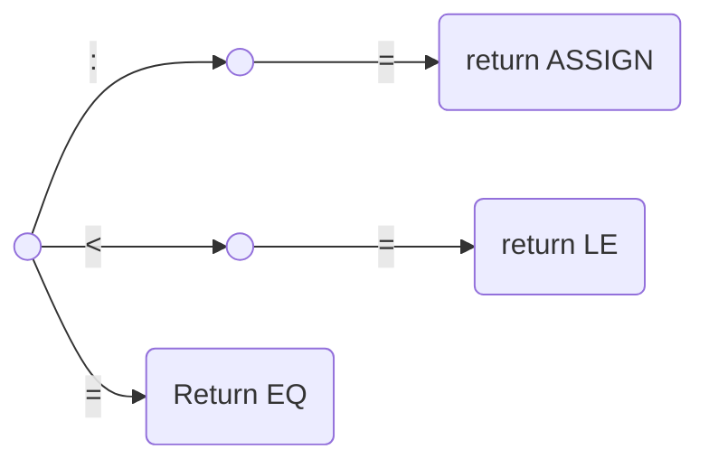
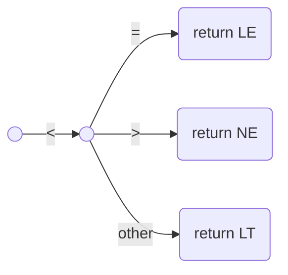
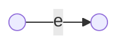
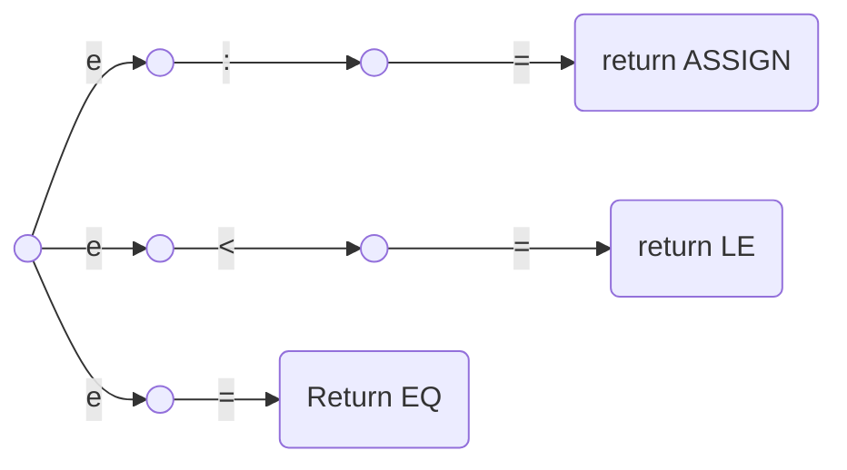

# 2. Scanning
## 2.1 Scanning Process
Tokens: The logical units the scanner generates

e.g.
  - if -> IF
  - \+ -> PLUS
  - 1234 -> NUM
  - "Hello" -> STRING

Attributes: Any value associated to a token
e.g.
  - 1234 -> ID:NUM, Attribute: 1234
  - "Hello" -> ID:STRING, Attribute: "Hello"

Token Record: Collection of all attributes in a single structured data type.

e.g.

```C++
typedef struct
{
    TokenType_e eTokenType;
    char*       szStringVal;
    int32_t     s32IntVal;
} TokenRecord_t;
```

## 2.2 Regular Expressions

## 2.3 Finite Automata
### 2.3.1 Deterministic Finite Automata (DFA)

A DFA $M$ consists of an alphabet $\Sigma$, a set of state $S$, a transition function $T: S \times \Sigma \rightarrow S$, a start state $s_0 \in S$, and a set of accepting state $A \subset S$. The language accepted by $M$, written $L(M)$, is defined to be the set of strings of characters $c_1c_2\dots c_n$ with each $c_i \in \Sigma$ such that there exist states $s_1 = T(s_0, c_1), s_2 = T(s_1,c_2) \dots, s_n=T(s_{n-1},c_n)$ with $s_n$ an element of $A$ (i.e., an accepting state).


Let's consider the tokens givens by the strings :=, <=, and =. Each of these is a fixed string, and DFAs for them can be written as follows.
Since each of these tokens begins with a different character, we can simply identify their start states to get the following DFA:



However, suppose we had several tokens that begin with the same character, such as <, <=, and <>. Now we cannot simply write the following diagram, since it is not a DFA (given a state and a character, there must always be a unique transition to a single new state).


In principle, we should be able to combine all the tokens into one giant DFA in this fashion. However, the complexity of such a task becomes enormous, especially if it is done in an unsystematic way.

A solution to this problem is to expand the definition of a finite automation to include the case where more than one transition from a state may exist for a particular character, whie at the same time developing an algorithm for systematically turning these new, generalized finite automata into DFAs.

### 2.3.2 Nondeterministic Finite Automata (NFA)
$\epsilon$-transition is a transition that may occur without consulting the input struing (and without consuming any characters).



$\epsilon$-transitions are somewhat counterintuitive, since they may occur "spontaneously," that is, without lookahead and without change to the input string, but they are useful in two ways.
  
  1. They can express a choice of alternatives in a way that does not involve combining states.
     This has the advantage of keeping the original automata intact and only adding a new start state to connect them.


  2. They can explicitly describe a match of the empty string


An NFA $M$ consists of an alphabet $\Sigma$, a set of state $S$, a transition function $T: S \times (\Sigma \cup \{\epsilon\})\rightarrow \wp(S)$, a start state $s_0$ from $S$, and a set of accepting state $A$ from $S$. The language accepted by $M$, written $L(M)$, is defined to be the set of strings of characters $c_1c_2\dots c_n$ with each $c_i$ from $\Sigma \cup \{\epsilon\}$ such that there exist states $s_1$ in $T(s_0, c_1)$, $s_2$ in $T(s_1,c_2) \dots, s_n$ in $T(s_{n-1},c_n)$ with $s_n$ an element of $A$.


