# 2. Scanning
## 2.1 Scanning Process
Tokens: The logical units the scanner generates

e.g.
  - if -> IF
  - \+ -> PLUS
  - 1234 -> NUM
  - "Hello" -> STRING

Attributes: Any value associated to a token
e.g.
  - 1234 -> ID:NUM, Attribute: 1234
  - "Hello" -> ID:STRING, Attribute: "Hello"

Token Record: Collection of all attributes in a single structured data type.

e.g.

```C++
typedef struct
{
    TokenType_e eTokenType;
    char*       szStringVal;
    int32_t     s32IntVal;
} TokenRecord_t;
```

## 2.2 Regular Expressions

## 2.3 Finite Automata
### 2.3.1 Deterministic Finite Automata (DFA)

A DFA $M$ consists of an alphabet $\Sigma$, a set of state $S$, a transition function $T: S \times \Sigma \rightarrow S$, a start state $s_0 \in S$, and a set of accepting state $A \subset S$. The language accepted by $M$, written $L(M)$, is defined to be the set of strings of characters $c_1c_2\dots c_n$ with each $c_i \in \Sigma$ such that there exist states $s_1 = T(s_0, c_1), s_2 = T(s_1,c_2) \dots, s_n=T(s_{n-1},c_n)$ with $s_n$ an element of $A$ (i.e., an accepting state).


Let's consider the tokens givens by the strings :=, <=, and =. Each of these is a fixed string, and DFAs for them can be written as follows.
Since each of these tokens begins with a different character, we can simply identify their start states to get the following DFA:

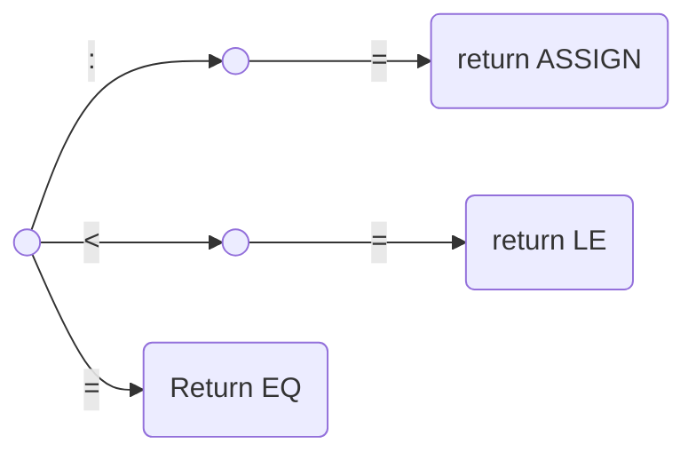

However, suppose we had several tokens that begin with the same character, such as <, <=, and <>. Now we cannot simply write the following diagram, since it is not a DFA (given a state and a character, there must always be a unique transition to a single new state).

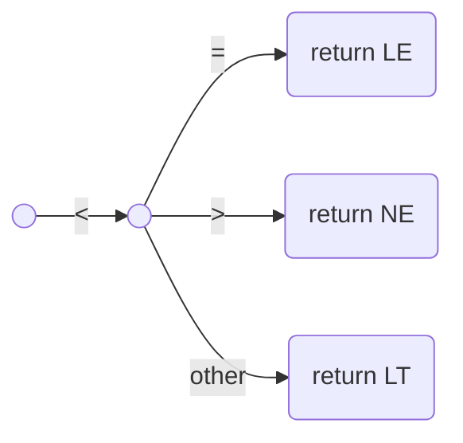
In principle, we should be able to combine all the tokens into one giant DFA in this fashion. However, the complexity of such a task becomes enormous, especially if it is done in an unsystematic way.

A solution to this problem is to expand the definition of a finite automation to include the case where more than one transition from a state may exist for a particular character, whie at the same time developing an algorithm for systematically turning these new, generalized finite automata into DFAs.

### 2.3.2 Nondeterministic Finite Automata (NFA)
$\epsilon$-transition is a transition that may occur without consulting the input string (and without consuming any characters).

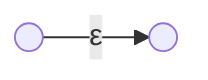

$\epsilon$-transitions are somewhat counterintuitive, since they may occur "spontaneously," that is, without lookahead and without change to the input string, but they are useful in two ways.
  
  1. They can express a choice of alternatives in a way that does not involve combining states.
     This has the advantage of keeping the original automata intact and only adding a new start state to connect them.
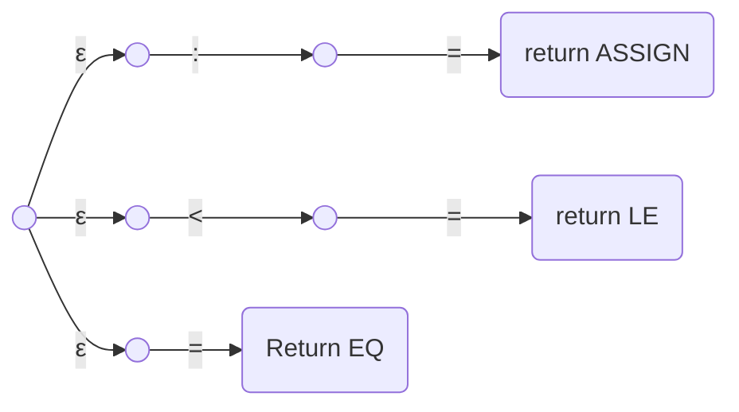

  2. They can explicitly describe a match of the empty string


An NFA $M$ consists of an alphabet $\Sigma$, a set of state $S$, a transition function $T: S \times (\Sigma \cup \lbrace\epsilon\rbrace)\rightarrow \wp(S)$, a start state $s_0$ from $S$, and a set of accepting state $A$ from $S$. The language accepted by $M$, written $L(M)$, is defined to be the set of strings of characters $c_1c_2\dots c_n$ with each $c_i$ from $\Sigma \cup \lbrace\epsilon\rbrace$ such that there exist states $s_1$ in $T(s_0, c_1)$, $s_2$ in $T(s_1,c_2) \dots, s_n$ in $T(s_{n-1},c_n)$ with $s_n$ an element of $A$.


## 2.4 From Regular expressions to DFAs
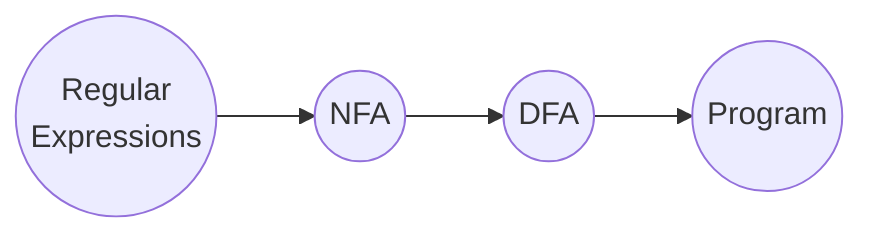

### 2.4.1 From a Regular Expression to an NFA
Thomson's construction: It uses $\epsilon$-transitions to glue together the machines of each piece of regular expression to form a machine that corresponds to the whole expression.

#### Basic Regular Expressions
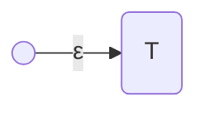

#### Concatenation
We wish to construct an NFA equivalent to the regular expression $rs$, where $r$ and $s$ are regular expressions. We assume (inductively) that NFAs equivalent to $r$ and $s$ have already been constructed.

We can connect the accepting state of the machine of $r$ to the start state of the machine of $s$ by an $\epsilon$-transition. The new machine has the start state of the machine of $r$ as its start state and the accepting state of the machine $s$ as its accepting state.
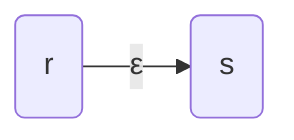
Clearly, this machine accepts $L(rs) = L(r)L(s)$ and so corresponds to the regular expression $rs$.


#### Choice Among Alternatives
We wish to construct an NFA corresponding to $r|s$ under the same assumption as before. We do this as follows.
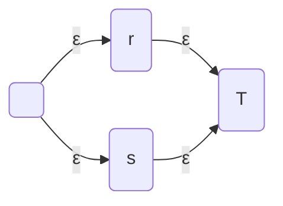

This machine accepts language $L(r|s) = L(r) \cup L(s) $.

#### Repetition
We want to construct a machine that corresponds to $r^*$, given a machine that corresponds to $r$. We do this as follows.
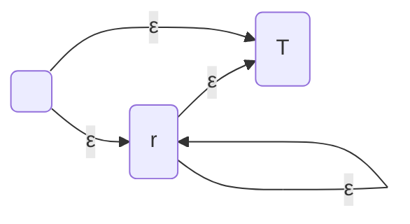


### 2.4.2 From an NFA to a DFA
#### The $\epsilon$-Closure of a Set of States
We define the $\epsilon$-closure of a single sate $s$ as the set of states reachable by a series of zero or more $\epsilon$-transitions, and we write this set as $\bar{s}$. Note that the $\epsilon$-closure of a state always contains the state itself.

##### Example
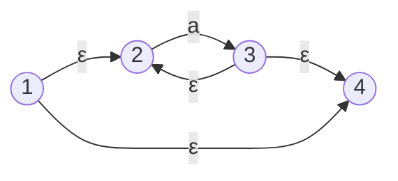
In this NFA, we have $\bar{1}=\lbrace1, 2, 4\rbrace, \bar{2}=\lbrace2\rbrace, \bar{3}=\lbrace2, 3, 4\rbrace, \bar{4}=\lbrace4\rbrace$.

We now define the $\epsilon$-closure of a set of states to be the union of the $\epsilon$-closures of each individual state. In symbols, if $S$ is a set of states, then we have 
$$ \bar{S} = \bigcup_{s \in S} \bar{s} $$

#### The Subset Construction
Now we can construct DFA from a given NFA $M$, which we will call $\overline{M}$. We first compute the $\epsilon$-closure of the start state of $M$; this becomes the start state of $\overline{M}$. For this set, and for each subsequent set, we compute transition on charactor $a$ as follows. Given a set $S$ of states and a charactor $a$ in the alphabet, compute the set $S'_a=\lbrace t | \text{for some } s \text{ in } S \text{ there is a transition from } s \text{ to } t \text{ on } a\rbrace$. Then, compute $\overline{S'_a}$, the $\epsilon$-closure of $S'_a$. This defines a new state in the subset constructio, together with a new transition $S \xrightarrow{a}{} \overline{S'_a}$ Continue with this process until no new states or transitions are created. Mark as accepting those states constructed in this manner that conatin an accepting state of $M$. This is the DFA $\overline{M}$.

##### Example
letter(letter|digit)*

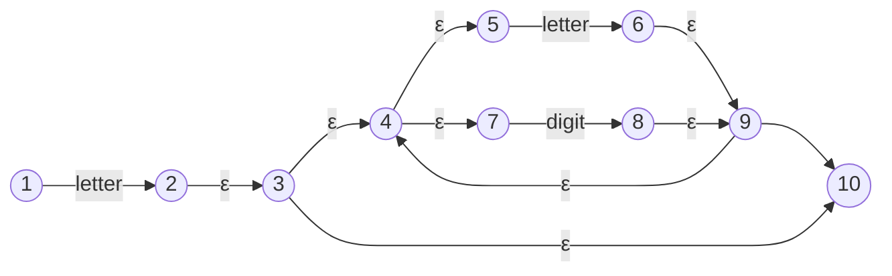
Start state: $\overline{\lbrace 1 \rbrace} = \lbrace1\rbrace$ 

Transition on letter to $\overline{\lbrace 2 \rbrace} = \lbrace2, 3, 4, 5, 7, 10\rbrace$ 

Transition on digit to $\overline{\lbrace 8 \rbrace} = \lbrace 4, 5, 7, 9, 10\rbrace$

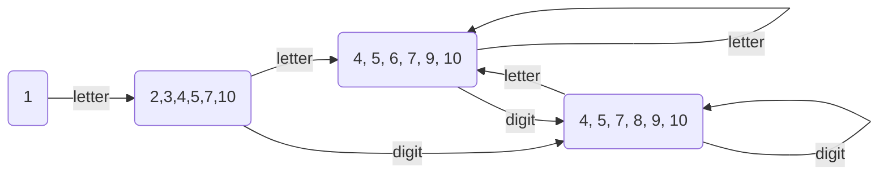

### 2.4.4 Minimizing the Number of States in a DFA

DFA derived from a regular expression may be more complex than necessary. Since efficiency is extremely important in a scanner, we would like to be able to construct, if possible, a DFA that is minimal in some sense. An important result from automata theory states that, given any DFA, there is an equivalent DFA containing a minimum number of states, and that this minimum-state DFA is unique.

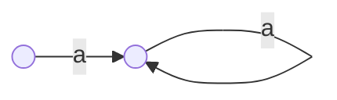

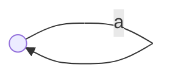


The algorithm proceeds by creating sets of states to be unified into single states. It begins with the most optimistic assumption possible: it creates two sets, one consisting of all the accepting states and the other consisting of all the nonaccepting states. Given this partition of the states of the original DFA, consider the transition on each character $a$ of the alphabet. If all accepting states have transitions on $a$ to nonaccepting states, then this defines an $a$-transition from the new accepting state to the new nonaccepting state. On the other hand, if there are two accepting states $s$ and $t$ that have transitions on $a$ that land in different sets, then no $a$-transition can be defined for this grouping of the states. We say that $a$ distinguishes the states $s$ and $t$.

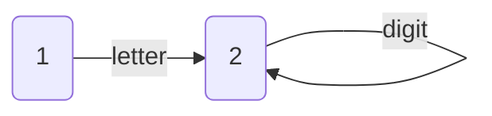

## 2.5 Implementation of a Scanner
C-- (minus minus) a C-like language scanner

### Reserved Words
- Control : if, else, for, while
- Type : void, char, short, int, long, float, double

### Special Symbols  
- Operators : +, -, *, /, !, ^, ~
- Operators (Bit): <<, >>, ^, ~
- Operators (Comparison): ==, <, >, <=, >=, !=
- Operators (Op & Assign): =, +=, -=, *=, /=, ^=, ~=, <<=, >>=
- Operators (Logic): &&, ||
- Parentheses (OTHER) : (, ), [, ], {, }
- Other (OTHER) : ., ;

### Other
- Number (NUM) : 1 or more letters
- Identifier (ID) : 1 or more letters
- Comments (CMNT) : //, /* */

### TODO
- Hexadecimal numbers
- % (modulus operator)


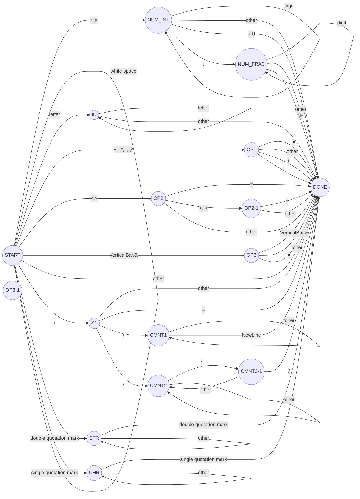