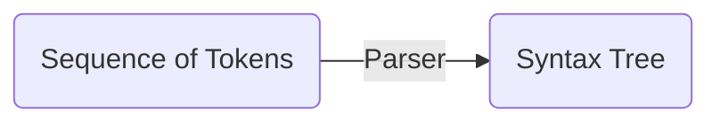
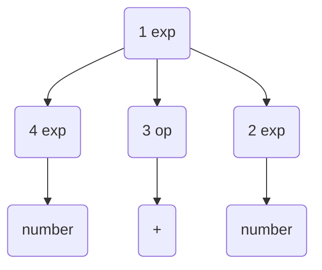
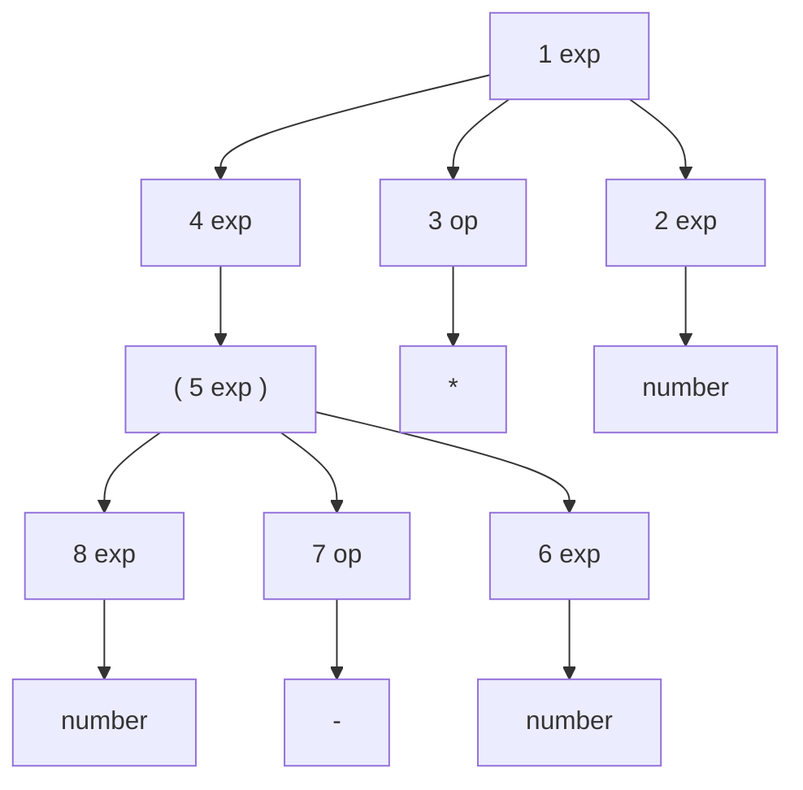
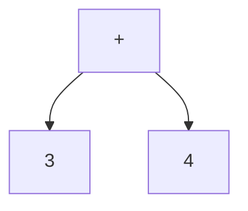
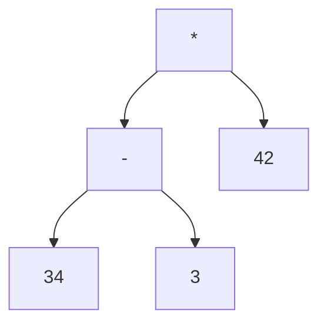
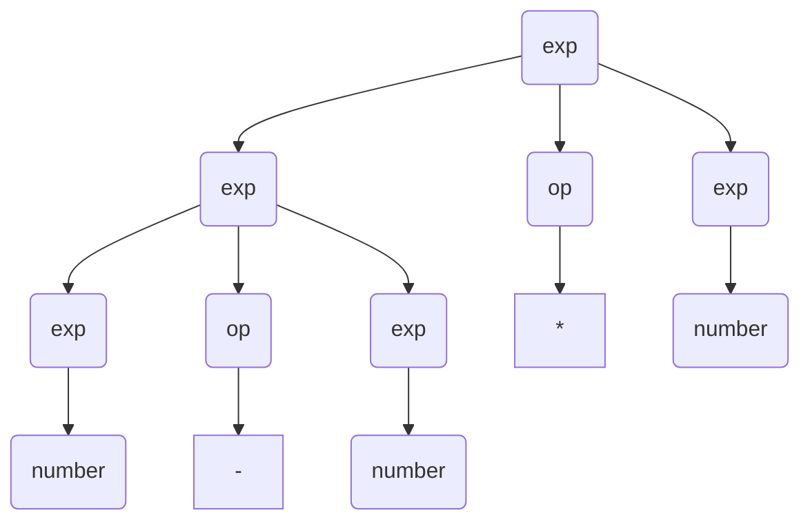
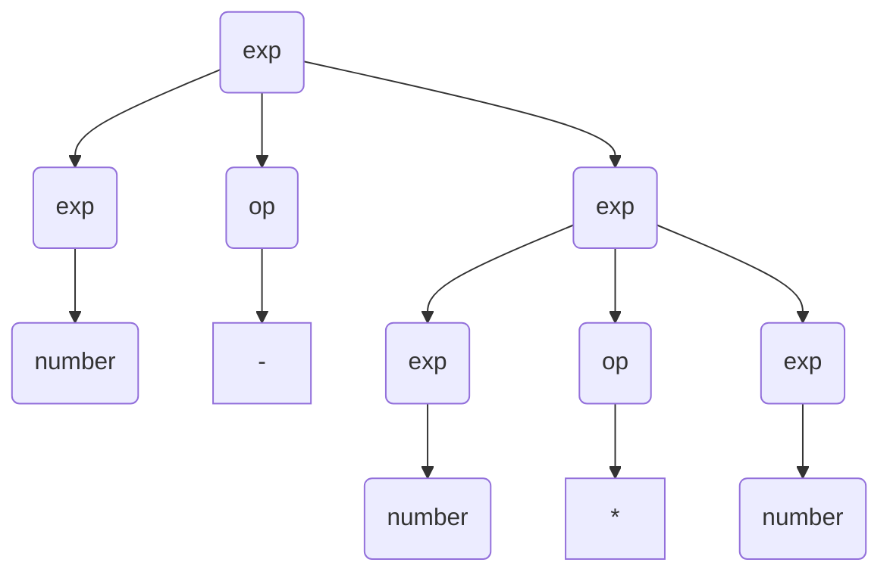
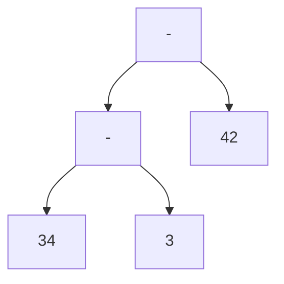
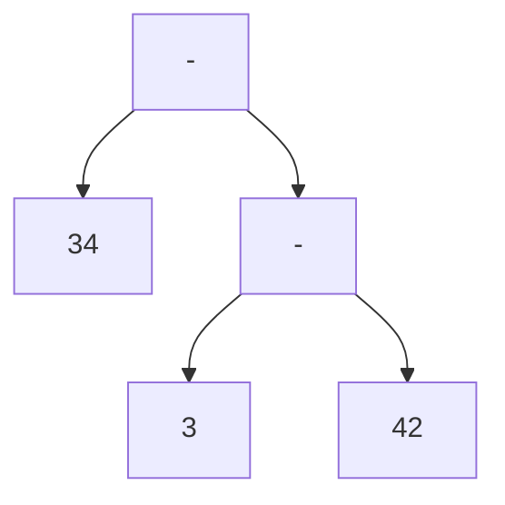

# 3. Context-Free Grammars and Parsing
Parsing: The task of determining the syntax, or structure of a program.

## 3.1 The Parsing Process


## 3.2 Context-Free Grammars
A context-free grammar: A specification for the syntactic structure of a programming language.
Such a specification is very similar to the specification of the lexical structure of a language using regular expressions, except that a context-free grammar involves recursive rules.

$$ exp \rightarrow exp \  op \  exp \ | \  ( exp ) \  | \  number $$

$$ op \rightarrow + | - | * $$

The notation was developed by John Backus and adapted by Peter Naur for the Algol60 report. Thus, grammar rules in this form are usually said to be in Backus-Naur form, or BNF.

A derivation: A sequence of replacements of structure names by choices on the right-hand sides of grammar rules. A derivation begins with a single structure name and ends with a string of token symbols.

### Example
A derivation for the arithmetic expression (34-3)*42

$$
\begin{split}
exp & \Rightarrow exp \  op \  exp \\
    & \Rightarrow exp \  op \  number \\
    & \Rightarrow exp \  * \  number \\
    & \Rightarrow (exp) \  * \  number \\
    & \Rightarrow (exp \  op \  exp) \  * \  number \\
    & \Rightarrow (exp \  op \  number) \  * \  number \\
    & \Rightarrow (exp \  - \  number) \  * \  number \\
    & \Rightarrow (number \  - \  number) \  * \  number \\
\end{split}
$$

Note that derivation steps use a different arrow from the arrow metasymbol in the grammar rules.

- Grammar rules: define $\rightarrow$
- derivation steps: construct $\Rightarrow$

The set of all strings of token symbols obtained by derivations from the $exp$ symbol is the language defined by the grammar of expressions. This can be written symbolically as 

$$ L(G) = \lbrace s | exp \Rightarrow *s \rbrace $$

where $G$ represents the expression grammar, $s$ represents an arbitrary string of token symbols (sometimes called a sentence), and the symbols $\Rightarrow *$ stand for a derivation consisting of a sequence of replacements.

- start symbol: The most general structure listed first in the grammar rules.
- nonterminals: Structure name since they always must be replaced further on in a derivation.
- terminals: Symbols in the alphabet since they terminate a derivation.

### Example
$$ E \rightarrow ( \ E \ ) \ | \ a $$

- Nonterminal: $E$
- Terminals: $(, ), a$

This grammar generates the language $L(G) = \lbrace a, (a), ((a)), (((a))), \dots \rbrace = \lbrace (^n a)^n \mid n \ge 0 \rbrace$


- left recursive: $A \rightarrow A\ a \mid a$
- right recursive: $A \rightarrow a\ A \mid a$

$\epsilon$-production: Notation for a grammar rule that generates the empty string: 

$$empty \rightarrow \epsilon$$

## 3.3 Parse Trees and Abstract Syntax Trees
### 3.3.1 Parse Trees
A parse tree: A labeled tree in which the interior nodes are labeled by nonterminals, the leaf nodes are labeled by terminals, and the children of each internal node represent the replacement of the associated nonterminal in one step of the derivation.

$$
\begin{split}
exp & \Rightarrow exp \ op \ exp  \\
    & \Rightarrow number \ op \ exp \\
    & \Rightarrow number \ + \ exp  \\
    & \Rightarrow number \ + \ number  \\
\end{split}
$$

corresponds to the parse tree

Preorder numbering (leftmost derivation)


Postorder numbering (rightmost derivation)


Parse tree for (34-3)*42 and derivations

This derivation a rightmost derivation, and the corresponding numbering of the parse tree is a reverse postorder numbering.


### 3.3.2 Abstract Syntax Trees
A parse tree is a useful representation of the structure of a string of tokens. However, a parse tree contains much more information than is absolutely necessary for a compiler to produce executable code.

Abstract Syntax Trees (Syntax Trees): Trees representing abstractions of the actual source code token sequences. However token sequences cannot be recovered from them unlike parse trees. Nevertheless they contain all the information needed for translation, in a more efficient form than parse tree.

Root node is simply labeled by the operation it represents, and the leaf nodes are labeled by their values.




Abstract syntax tree can be thought of as a tree representation of a shorthand notation called abstract syntax. For example, the abstract syntax for the expression 3+4 might be written as $OpExp(Plus, ConstExp(3), ConstExp(4))$, and the abstract syntax for the epxression (34-3)*42 might be written as 
$$ OpExp(Times, OpExp(Minus, ConstExp(34), ConstExp(3)), ConstExp(42))$$

Indeed, abstract syntax can be given a formal definition using a BNF-like notation, just like concrete syntax.

$$ exp \rightarrow OpExp(op, exp, exp) \mid ConstExp(integer) $$

$$ op \rightarrow Plus \mid Minus \mid Times $$

The abstract syntax trees for our simple arithmetic expressions can be given by the C++ data type declaration.
```C++
enum OpType_e
{
    PLUS,
    MINUS,
    TIMES
};

enum ExpType_e
{
    OP,
    CONST
};

struct STreeNode_t
{
    ExpType_e eType;
    OpType_e eOp;
    STreeNode_t* pstLChild;
    STreeNode_t* pstRChild;
    int val;
};
```

## 3.4 Ambiguity
It is possible for a grammar to permit a string to have more than one parse tree.

### Example
34-3*42





A grammar that generates a string with two distinct parse trees is called an ambiguous grammar.

Tow basic methods to deal with ambiguities.
1. Disambiguating rule : To state a rule that specifies in each ambiguous case which of the parse trees is the correct one. Disadvantage is that the syntactic structure of the language is no longer given by the grammar alone.

2. To change the grammar into a form that forces the construction of the correct parse tree, thus removing the ambiguity. The standard solution is to give addition and subtraction the same precedence, and to give multiplication a higher precedence.

Unfortunately, method 2 does not completely remove the ambiguity of the grammar. Consider the string 34-3-42. This string also has two possible syntax trees.

(34 - 3) - 42 = -11 (correct)


34 - (3 - 42) = 73 (wrong)

Subtraction is considered to be left associative; that is, a series of subtraction operations is performed from left to right.

Addition, subtraction, and multiplication operations are left associative.

### 3.4.2 Precedence and Associativity
To handle precedence of operations in the grammar, we must group the operators into groups of equal precedence, and for each precedence we must write a different rule.

$$ exp \rightarrow exp \ addop \ term \mid term $$

$$ addop \rightarrow + \mid - $$

$$ term \rightarrow term \ mulop \ term \mid factor $$

$$ mulop \rightarrow * $$

$$ factor \rightarrow (\ exp \ ) \mid number $$


We call such a grouping a precedence cascade.

### 3.4.3 The Dangling Else Problem

$$ statement \rightarrow if\text-stmt \mid other $$

$$ if\text-stmt \rightarrow if \ ( \ exp \ ) \ statement \mid if \ ( \ exp \ ) \ statement \ else \ statement $$

$$ exp \rightarrow 0 \mid 1 $$

This grammar is ambiguous as a result of the optional else.

if (0) if (1) other else other

```C++
if(0)
    if(1)
        other
else
    other
```

```C++
if(0)
    if(1)
        other
    else
        other
```
This ambiguity is called the dangling else problem.

The most closely nested rule: else-part should always be associated with the nearest if-statement that does not yet have an associated else-part.

### 3.4.4 Inessential Ambiguity

## 3.5 Extended Notations: EBNF and Syntax Diagrams
### 3.5.1 EBNF Notation
Extended BNF (EBNF)
#### Repetition
Generic rules

$ A \rightarrow A \ \alpha \ \mid \  \beta$ (Left Recursive)

$ A \rightarrow \alpha \ A \ \mid \  \beta$ (Right Recursive)

where
- $\alpha$ and $\beta$ are arbitrary strings of terminals and nonterminals 
- In Left Recursive $\beta$ does not begin with $A$
- In Right Recursive $\beta$ does not end with $A$.

It would be possible to use the same notation for repetition that regular expressions use, namely, the asterisk *.

$ A \rightarrow \beta \ \alpha *$

$ A \rightarrow \alpha* \ \beta $

Instead, EBNF opt to use curly brackets {...} to express repetition.

$ A \rightarrow \beta \ \lbrace \alpha \rbrace $

$ A \rightarrow \lbrace \alpha \rbrace \ \beta $

##### Example of problem with any repetition notation

$$ stmt\text-sequence \rightarrow stmt \ ; \ stmt\text-sequence \ \mid \ stmt $$

$$ stmt \rightarrow s $$

This rule has the form $A \rightarrow \alpha \ A \ \mid \ \beta$, with $A = stmt\text-sequence, \ \alpha = stmt \ ;, \ and \ \beta = stmt$. 

Problem: $\beta$ can end with $A$!

In EBNF this would appear as

$ stmt\text-sequence \rightarrow \lbrace stmt \ ; \ \rbrace \ stmt $    (right recursive form)

$ stmt\text-sequence \rightarrow stmt \ \lbrace  \ ; \ stmt \rbrace $    (left recursive form)


A more significant problem occurs when the associativity matters, as it does for binary operations such as subtraction and division.

$$ exp \rightarrow exp \ addop \ term \mid \ term $$

$$ term \rightarrow term \ mulop \ term \mid factor $$

$$ factor \rightarrow (\ exp \ ) \mid number $$

This has the form $A \rightarrow A \ \alpha \ \mid \ \beta$, with $A = exp, \ \alpha=addop\ term, \ and \ \beta=term$.

We write this rule in EBNF as

$ exp \rightarrow term \ \lbrace \ addop \ term \ \rbrace $ (Left Associativity)

$ exp \rightarrow \lbrace \ term \ addop  \ \rbrace \ term $ (Right Associativity)

#### Optional
A right recursive rule such as

$$ stmt\text-sequence \rightarrow stmt \ ; \ stmt\text-sequence \ \mid \ stmt $$

is viewed as being a $stmt$ followed by an optional semicolon and $stmt\text-sequence$.

Optional constructs in EBNF are indicated by surrounding them with square brackets [...].

For example, the grammar rules for if-statements with optional else-parts would be written as follows in EBNF:


$ statement \rightarrow if\text-stmt \ \mid \ other $

$ if\text-stmt \rightarrow if \ ( \ exp \ ) \ statement \ [ \ else \ statement \ ] $

$ exp \rightarrow 0 \mid 1 $


Also, a right recursive rule such as

$ stmt\text-sequence \rightarrow stmt \ ; \ stmt\text-sequence \ \mid \ stmt$

is written as 

$ stmt\text-sequence \rightarrow stmt \ [\ ; \ stmt\text-sequence ]$

