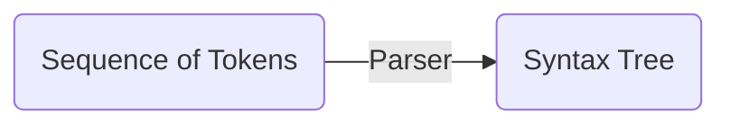
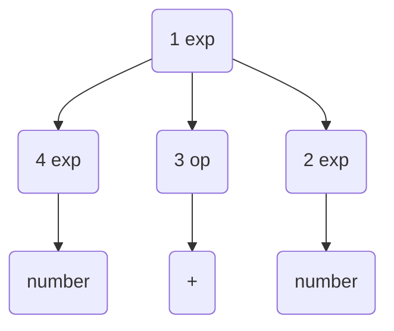

# 3. Context-Free Grammars and Parsing
Parsing: The task of determining the syntax, or structure of a program.

## 3.1 The Parsing Process

## 3.2 Context-Free Grammars
A context-free grammar: A specification for the syntactic structure of a programming language.
Such a specification is very similar to the specification of the lexical structure of a language using regular expressions, except that a context-free grammar involves recursive rules.

$$ exp \rightarrow exp \; op \; exp \;| \; ( exp ) \; | \; number $$
$$ op \rightarrow + | - | * $$

The notation was developed by John Backus and adapted by Peter Naur for the Algol60 report. Thus, grammar rules in this form are usually said to be in Backus-Naur form, or BNF.

A derivation: A sequence of replacements of structure names by choices on the right-hand sides of grammar rules. A derivation begins with a single structure name and ends with a string of token symbols.

### Example
A derivation for the arithmetic expression (34-3)*42

$$
\begin{split}
exp & \Rightarrow exp \; op \; exp \\
    & \Rightarrow exp \; op \; number \\
    & \Rightarrow exp \; * \; number \\
    & \Rightarrow (exp) \; * \; number \\
    & \Rightarrow (exp \; op \; exp) \; * \; number \\
    & \Rightarrow (exp \; op \; number) \; * \; number \\
    & \Rightarrow (exp \; - \; number) \; * \; number \\
    & \Rightarrow (number \; - \; number) \; * \; number \\

\end{split}
$$

Note that derivation steps use a different arrow from the arrow metasymbol in the grammar rules.

- Grammar rules: define $\rightarrow$
- derivation steps: construct $\Rightarrow$

The set of all strings of token symbols obtained by derivations from the $exp$ symbol is the language defined by the grammar of expressions. This can be written symbolically as 

$$ L(G) = \left\{ s | exp \Rightarrow *s \right\} $$

where $G$ represents the expression grammar, $s$ represents an arbitrary string of token symbols (sometimes called a sentence), and the symbols $\Rightarrow *$ stand for a derivation consisting of a sequence of replacements.

- start symbol: The most general structure listed first in the grammar rules.
- nonterminals: Structure name since they always must be replaced further on in a derivation.
- terminals: Symbols in the alphabet since they terminate a derivation.

### Example
$$ E \rightarrow ( \; E \; ) \; | \; a $$

- Nonterminal: $E$
- Terminals: $(, ), a$

This grammar generates the language $L(G) = \left\{ a, (a), ((a)), (((a))), \dots \right\} = \left\{ (^n a)^n \mid n \ge 0 \right\}$

- left recursive: $A \rightarrow A\;a \mid a$
- right recursive: $A \rightarrow a\;A \mid a$

$\epsilon$-production: Notation for a grammar rule that generates the empty string: 

$$empty \rightarrow \epsilon$$

## 3.3 Parse Trees and Abstract Syntax Trees
### 3.3.1 Parse Trees
A parse tree: A labeled tree in which the interior nodes are labeled by nonterminals, the leaf nodes are labeled by terminals, and the children of each internal node represent the replacement of the associated nonterminal in one step of the derivation.

$$
\begin{split}
exp & \Rightarrow exp \; op \; exp  \\
    & \Rightarrow number \; op \; exp \\
    & \Rightarrow number \; + \; exp  \\
    & \Rightarrow number \; + \; number  \\
\end{split}
$$

corresponds to the parse tree

Preorder numbering (leftmost derivation)

Postorder numbering (rightmost derivation)

