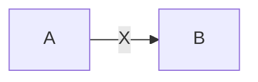
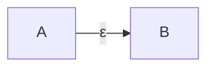
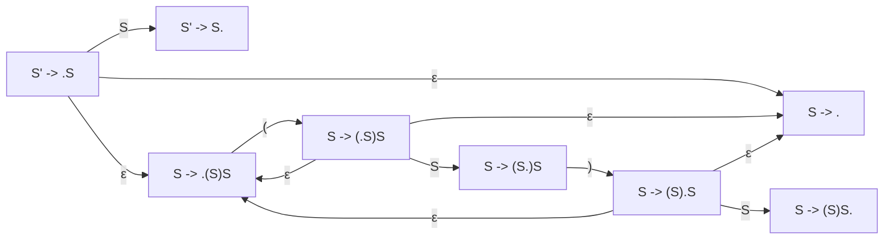
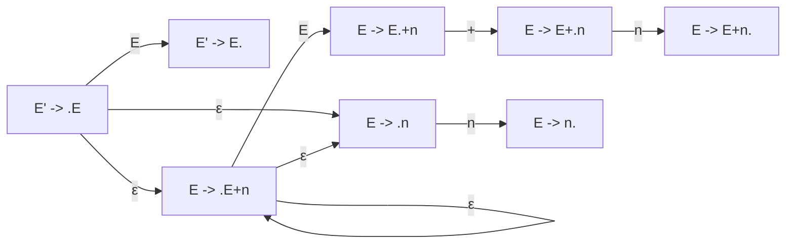
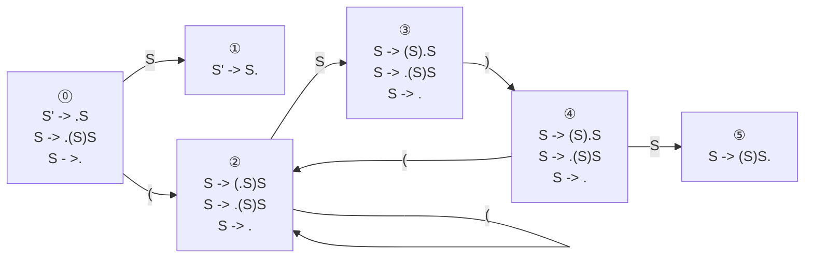
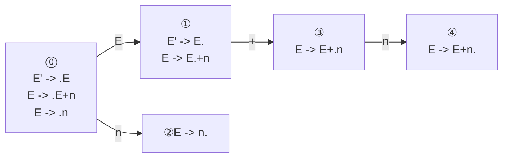
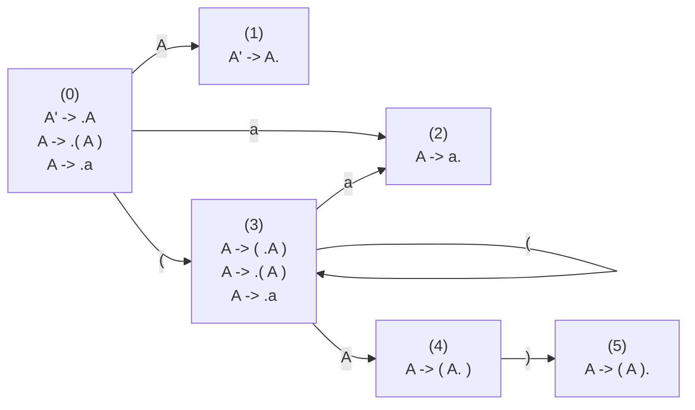

# 5. Bottom-Up Parsing
The most general bottom-up algorithm is called LR(1) parsing.
- L indicates the input is processed from left to right.
- R indicates that a rightmost derivation is produced.
- (1) indicates that one symbol of lookahead is used.

LR(0) parsing - No lookahead is consulted in making parsing decisions.

SLR(1) - An improvement of LR(0) parsing (for simple LR(1) parsing).

LALR(1) parsing - A method that is slightly more powerful than SLR(1) parsing but less complex than general LR(1) parsing (for lookahead LR(1) parsing).

Bottom-up parsing algorithms are in general more powerful than top-down methods. For example, left recursion is not a problem in bottom-up parsing. Not unexpectedly, the constructions involved in these algorithms are also more complex. Bottom-up methods are really too complex for hand coding, but are well suited for parser generators like Yacc.

## 5.1 Overview of Bottom-Up Parsing
A bottom-up parser uses an explicit stack to perfrom a parse, similar to a nonrecursive top-down parser. The parsing stack will contain both tokens and nonterminals, and also some extra state information. The stack is empty at the beginning of a bottom-up parse and will contain the start symbol at the end of a successful parse.

A bottom-up parser has two possible actions (besides "accept")
1. Shift a terminal from the front of the input to the top of the stack.
2. Reduce a string $\alpha$ at the top of the stack to nonterminal $A$, given the BNF choice $A \rightarrow \alpha$.

A bottom-up parser is thus sometimes called a *shift-reduce* parser. One further feature of botom-up parsers is that grammars are always augmented with a new start symbol. This means that if $S$ is the start symbol, a new start symbol $S'$ is added to the grammar, with a single unit production to the previous start symbol: $S' \rightarrow S$.

#### Example 5.1
Consider the following augmented grammar for balanced parentheses:

$S' \rightarrow S$

$S \rightarrow ( \ S \ ) \ S \ \mid \ \epsilon$

A bottom-up parse of the string "( )" using this grammar is given in Table 5.1.

Table 5.1 Parsing actions of a bottom-up parser for the grammar of Example 5.1
|#|Parsing stack|Input|Action|
|-|-|-|-|
|1|\$ | $( )$     $| shift|
|2|\$ $($ | $)$ $| reduce $S \rightarrow \epsilon$|
|3|\$ $( \ S \  $| $)$ $| shift |
|4|\$ $( \ S \ )$| $| reduce $S \rightarrow \epsilon$|
|5|\$ $( \ S \ ) \ S$ | $| reduce $S \rightarrow ( \ S \ ) \ S$|
|6|\$ $S$ | $| reduce $S' \rightarrow S$|
|7|\$ $S'$ | $| accept|

#### Example 5.2

Consider the following augmented grammar for rudimentary arithmetic expressions (no parentheses and one operation):

$E' \rightarrow E$

$E \rightarrow E + n \ \mid \ n$

A bottom-up parse of the string $n + n$ using this grammar is given in Table 5.2.

Table 5.2 Parsing actions of a bottom-up parser for the grammar of Example 5.2

|#|Parsing Stack|Input|Action|
|-|-|-|-|
|1| $| $n+n$ $| shift|
|2| $ $n$| $+n$ $| reduce $E \rightarrow n$|
|3| $ $E$| $+n$ $| shift |
|4| $ $E+$| $n$ $| shift |
|5| $ $E+n$| $| reduce $E \rightarrow E + n$ |
|6| $ $E$| $| reduce $E' \rightarrow E$ |
|7| $ $E'$| $| accept |

General observations on characteristics of intermediate stages of the bottom-up parse.

A shift-reduce parser traces out a rightmost derivation of the input string, but the steps of the derivation occur in reverse order (*right sentential form*).
$$ S' \Rightarrow S \Rightarrow ( \ S \ ) \ S \Rightarrow ( \ S \ ) \Rightarrow ( \ )$$
$$ E' \Rightarrow E \Rightarrow E + n \Rightarrow n+n$$
viable prefix: the sequence of symbols on the parsing stack.

A shift-reduce parser will shift terminals from the input to the stack until it is possible to perform a reduction to obtain the next right sentential form. This will occur when the string of symbols on the top of the stack matches the right-hand side of the production that is used in the next reduction. 

This string, together with the position in the right sentential form where it occurs, and the production used to reducte it is called the *handle* of the right sentential form.

Determining the next handle in a parse is the main task of a shift-reduce parser.

## 5.2 Finite Automata of LR(0) Items And LR(0) Parsing

### 5.2.1 LR(0) Items
An LR(0) item (or just item for short) of a context-free grammar is a production choice with a distinguished position in its right-hand side. Thus, if $A \rightarrow \alpha$ is a production choice, and if $\beta$ and $\gamma$ are any two strings of symbols (including empty string $\epsilon$) such that $\beta \gamma = \alpha$, then $A \rightarrow \beta . \gamma$ is an LR(0) item. These are called LR(0) items because they contain no explicit reference to lookahead.

#### Dot symbol (.)
$A \rightarrow BCD$

LR(0) item: Production rules that have dot (.) on the right.

$A \rightarrow .BCD$

$A \rightarrow B.CD$ : $B$ is already seen. $CD$ is string to be read.

$A \rightarrow BC.D$

$A \rightarrow BCD.$ : $BCD$ is already seen. Now we can reduce $BCD$ to $A$.

#### Example 5.3
Consider the grammar of Example 5.1:

$S' \rightarrow S$

$S \rightarrow ( \ S \ ) \ S \ \mid \ \epsilon$

This grammar has three production choices and eight items:

1. $S' \rightarrow .S$
2. $S' \rightarrow S.$
3. $S \rightarrow .(S)S$
4. $S \rightarrow (.S)S$
5. $S \rightarrow (S.)S$
6. $S \rightarrow (S).S$
7. $S \rightarrow (S)S.$
8. $S \rightarrow .$

#### Example 5.4
The grammar of Example 5.2 has the following eight items

Grammar

$E' \rightarrow E$

$E \rightarrow E + n \ \mid \ n$

Items

1. $E' \rightarrow .E$
2. $E' \rightarrow E.$
3. $E \rightarrow .E+n$
4. $E \rightarrow E.+n$
5. $E \rightarrow E+.n$
6. $E \rightarrow E+n.$
7. $E \rightarrow .n$
8. $E \rightarrow n.$

The idea behind the concept of an item
- Item $A \rightarrow \beta . \gamma$ constructed from $A \rightarrow \alpha$ (with $\alpha = \beta \gamma$) means that $\beta$ has already been seen and that it may be possible to derive the next input tokens from $\gamma$.
- In terms of parsing stack, this means that $\beta$ must appear at the top of the stack.
- An item $A \rightarrow .\alpha$ means that we may be about to recognize an $A$ by using the grammar rule choice $A \rightarrow \alpha$ (*initial items*).
- An item $A \rightarrow \alpha.$ means that $\alpha$ now resides on the top of the parsing stack and may be the handle, if $A \rightarrow \alpha$ is to be used for the next reduction (*complete items*).

### 5.2.2 Finite Automata of Items
The LR(0) items can be used as the states of a finite automation that maintains information about the parsing stack and the progress of a shift-reduce parse. This will start out as a nondeterministic finite automation.

From this NFA of LR(0) items we can construct the DFA of sets of LR(0) items.

Consider the item $A \rightarrow \alpha . \gamma$ and suppose $\gamma$ begins with the symbol $X$, which may be either a token or a nonterminal, so that the item can be written as $A \rightarrow \alpha.X\eta$. Then there is a transition on the symbol $X$ from the state represented by this item to the state represented by the item $A \rightarrow \alpha X.\eta$. In graphical form we write this as

A: $A \rightarrow \alpha. X\eta$

B: $A \rightarrow \alpha X.\eta$

If $X$ is nonterminal, then the interpretationof this transition is more complex, since $X$ will nver appear as an input symbol. In fact, such a transition will still correspond to the pushing of $X$ onto the stack during a parse, but this can only occur during a reduction by a production $X \rightarrow \beta$. Now, since such a reduction must be preceded by the recognition of a $\beta$, and the state given by the initial item $X \rightarrow . \beta$ represents the beginning of this process, then for every item $A \rightarrow \alpha . X \eta$ we must add an $\epsilon$-transition

A: $A \rightarrow \alpha. X\eta$

B: $X \rightarrow .\beta$

These two cases represent the only transitions in the NFA of LR(0) items.

The start state of the NFA should correspond to the initial state of the parser: the stack is empty, and we are about to recognize an $S$, where $S$ is the start symbol of the grammar. Thus, any initial item $S \rightarrow .\alpha$ constructed from a production choice for $S$ could serve as a start state.

Augment: $S' \rightarrow S$, where $S'$ is a new nonterminal. $S'$ then becomes the start state of the augmented grammar, and the initial item $S' \rightarrow .S$ becomes the start state of the NFA.

#### Example 5.5
In Example 5.3, we listed the eight LR(0) items of the grammar. The NFA, therefor, has eight states; it is shown in Figure 5.1.

Figure 5.1 The NFA of LR(0) items for the grammar of Example 5.5

#### Example 5.6
In Example 5.4 we listed the LR(0) items associated with the grammar of Example 5.2.
The NFA of items appears in Figure 5.2. Note that the initial item $E \rightarrow .E + n$ has an $\epsilon$-transition to itself.

1. $E' \rightarrow .E$
2. $E' \rightarrow E.$
3. $E \rightarrow .E+n$
4. $E \rightarrow E.+n$
5. $E \rightarrow E+.n$
6. $E \rightarrow E+n.$
7. $E \rightarrow .n$
8. $E \rightarrow n.$

Figure 5.2 The NFA of LR(0) items for the grammar of Example 5.6

#### Example 5.7
Consider the NFA of Figure 5.1. The state of the associated DFA is the $\epsilon$-closure of the set consisting of the item e.g., $S' \rightarrow .S$, and its $\epsilon$-closure is the same state of DFA $\lbrace S'\rightarrow .S, \ S \rightarrow .( \ S \ ) \ S, \ S \rightarrow .\rbrace$.

The complete DFA is given in Figure 5.3

#### Example 5.8
Consider NFA of Figure 5.2. The DFA of the NFA is given in Figure 5.4

Figure 5.4 The DFA of sets of items corresponding to the NFA of Figure 5.2

In the construction of DFA of sets of LR(0) items, a distinction is sometimes made between those items that are added to a state during the $\epsilon$-closure step and those that originate the state as targets of non-$\epsilon$-transitions.

*closure items* : items that are added to a state during the $\epsilon$-closure step.

*kernel items* : items that originate the state as targets of non-$\epsilon$-transitions.

The importance of the distinction is that, given the grammar, the kernel items uniquely determine the state and its transitions. Thus only kernel items need to be specified to completely characterize the DFA of sets of items. Parser generators that construct the DFA may, therefore, only report the kernel items (this is true of Yacc, for instance).

A further simplication occurs if the DFA of sets of items is computed directly.

### 5.2.3 The LR(0) Parsing Algorithm

The LR(0) Parsing algorithm.

Let $s$ be the current state (at the top of the parsing stack). Then actions are defined as follows:

1. If state $s$ contains any item of the form $A \rightarrow \alpha . X \beta$, where $X$ is a terminal
 - To shift the current input token onto the stack
 - if input token $X$ - Push the state containing the item $A \rightarrow \alpha X. \beta$ on the stack.
 - if input token is not $X$, error.

2. If state $s$ contains any complete item ($A \rightarrow \gamma.$)
- To reduce by the rule $A \rightarrow \gamma.$
- If input is empty, a reduction by the rule $S' \rightarrow S$, where $S$ is the start state.
- error if the input is not empty.
- In all other cases, the new state is computed as follows.
  - Remove the string $\gamma$ and all of its corresponding states from the parsing stack.
  Correspondingly, back up in the DFA to the state from which the construction of $\gamma$ began.
  - This state must contain an item of the form $B \rightarrow \alpha .A \beta$. Push $A$ onto the stack, and push the state containing the item $B \rightarrow \alpha A. \beta$.

A grammar is said to be an LR(0) grammar if the above rules are unambiguous.

#### Example 5.9
Consider the grammar

$A' \rightarrow A$

$A \rightarrow ( \ A \ ) \ \mid \ a$

LR(0) items
1. $A' \rightarrow .A$
2. $A' \rightarrow A.$
3. $A \rightarrow .( \ A \ )$
4. $A \rightarrow ( \ .A \ )$
5. $A \rightarrow ( \ A \ .)$
6. $A \rightarrow ( \ A \ ).$
7. $A \rightarrow .a$
8. $A \rightarrow a.$

Table 5.3 Parsing actions for Example 5.9
|#|Parsing Stack (token, state) |Input |Action |
|-|-|-|-|
|1| $0 | ( ( a ) ) $| shift|
|2| $0 (3| ( a ) ) $| shift|
|3| $0 (3 (3 | a ) ) $| shift|
|4| $0 (3 (3 a2| ) )| reduce $A \rightarrow a$|
|5| $0 (3 (3 A4| ) )| shift|
|6| $0 (3 (3 A4 )5| )| reduce $A \rightarrow (\ A \ )$|
|7| $0 (3 A4| ) | shift|
|8| $0 (3 A4 )5 | | reduce $A \rightarrow (\ A \ )$|
|9| $0 A| | accept|

In #4, symbol $a$ and state 2 are popped from the stack, backing up to state 3. $A$ is then pushed onto the stack and the $A$ transition from state 3 to state 4.

In #6, reduction by the rule $A \rightarrow ( \ A \ )$ occurs, popping states 5, 4, 3, and symbols ), A, ( from the stack. Then we are now in state 3, and againpush A and state 4 onto the stack.

Table 5.4 Parsing table for the grammar of Example 5.9

|State |Action | Rule  | ( |  a | )  | Goto  |
|------|-------|-------|--| -- |--|---|
| 0 | shift |       | 3  |  2  |  |  1  |
| 1 | reduce | $A' \rightarrow A$ |  |  |  |  |
| 2 | reduce | $A \rightarrow a$ |  |  |  |  |
| 3 | shift |       | 3 |  2  |  | 4  |
| 4 | shift |       |  |  | 5 |  |
| 5 | reduce | $A\rightarrow (\ A \ ).$ |  |  |  |  |

- *goto* : The next state to transition to on nonterminals.
- *shift-reduce conflict* : $A \rightarrow \alpha$,  $A \rightarrow \alpha . X \beta$ ($X$ a terminal)
- *reduce-reduce conflict* : for $B \rightarrow \beta.$ confliction on which production to use for the reduction ($A \rightarrow \alpha$  or $B \rightarrow \beta$)

## 5.3 SLR(1) Parsing
### 5.3.1 The SLR(1) Parsing Algorithm
Simple LR(1), or SLR(1), parsing uses the DFA of sets of LR(0) items.

It increases the power of LR(0) parsing significantly, however, by using the next token in the input string to direct its actions. It does so in two ways.
1. It consults the input token before a shift to make sure that an appropretate DFA transition exists.
2. It uses the Follow set of a nonterminal to decide if a reduction should be performe.

#### Definition
The SLR(1) parsing algorithm.

Let $s$ be the current state (at the top of the parsing stack). Then actions are defined as follows.

1. If state $s$ contains any item of the form $A \rightarrow \alpha .X \beta$, where $X$ is a terminal, and $X$ is the next token in the input string
- To shift the current input token onto the stack
- Push the state containing the item $A \rightarrow \alpha X . \beta$ on the stack.

2. If state $s$ contains the complete item $A \rightarrow \gamma.$, and the next token in the input string is in $Follow(A)$
- To reduce by the rule $A \rightarrow \gamma.$ A reduction by the rule $S' \rightarrow S$, where $S$ is the start state.
- In all other scases, the new state is computed as follows.
  - Remove the string $\gamma$ and all of its corresponding states from the parsing stack. 
  - Correspondingly, back up in the DFA to the state from which the construction of $\gamma$ began. By construction, this state must contain an item of the form $B \rightarrow \alpha. A \beta$.
  - Push $A$ onto the stack, and push the state containing the item $B \rightarrow \alpha A . \beta$.

3. If the next input token is such that neither of the above two cases applies, an error is declared.

s: shift

r: reduce

s3 : shift, transition to state 3

