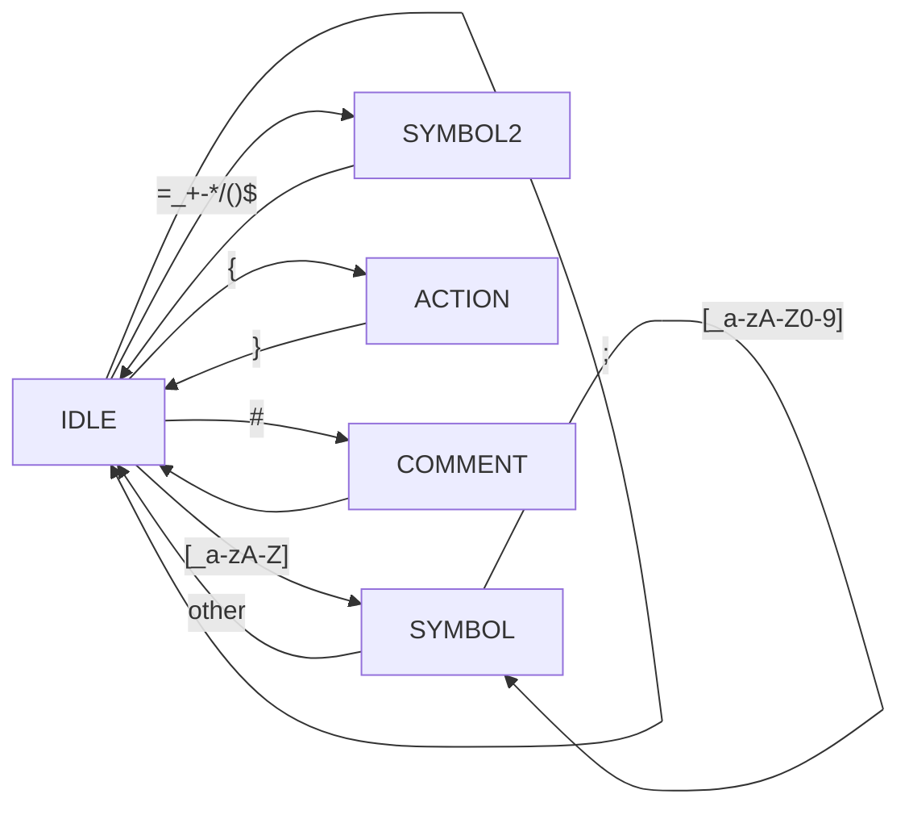
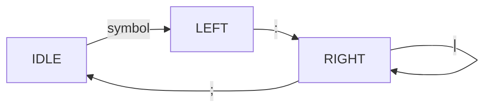

# Grammar File Parser
## 1. Grammar File Syntax

```python
# definitions

%{
# external dependencies in a language to be used for implementation.
%}

%%
# rules

NON_TERMINAL1 : 
    NUMBER PLUS NUMBER {
        # action to be done when the symbols are reduced to NON_TERMINAL1
        # $$ : return value
        # $1 : 1st symbol
        # $3 : 3rd symbol
        $$ = $1 + $3
    }
    |   # or operator
    NUMBER MINUS NUMBER {
        # action for the rule
        $$ = $1 - $3
    }
    ;   # The definition of a rule shall end with ';'

NON_TERMINAL2 : 
    SYMBOL1 {
        # action to be done when symbol1 is read
    }
    SYMBOL2 {
        # action to be done when symbols are reduced to NON_TERMINAL2
    }
    ;
%%
# auxiliary routines

```

The left symbol of the first rule is considered as a start symbol.

DFA of the Grammar Lexer



DFA of the Grammar Parser
