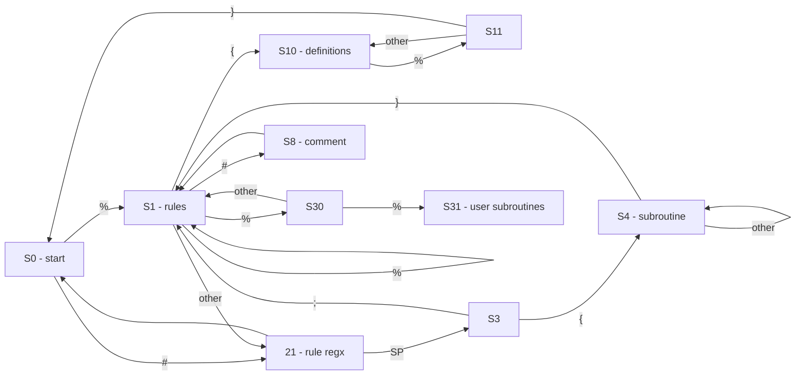
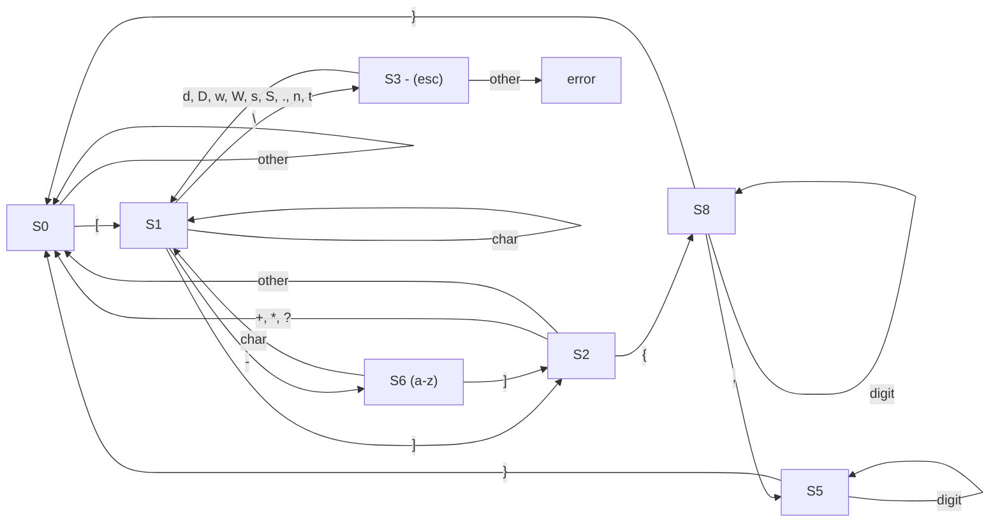

# Lexer Generator

## 1. Lex Syntax

## 2. Lex file parser

## 2. Regx Parser
A limited regular expression parser

| Symbol | Description |
|-|-|
|[ ] | Matched a single character that is contained within the brackets. |
| {m} | Matched the preceding element at least m. |
| {m, n} | Matches the preceding element at least m and not more than n times. |
| ? | Matches the preceding element zero or one time. |
| + | Matches the preceding element one or more times. |
| * | Matches the preceding element zero or more times. |
|a-z| Specifies a range which matches any letter from a to z|

### 2.1 Supported Regular Expression

