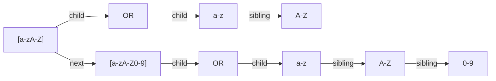

# RegEx Parser

## 1. Introduction
The goal is to implement somewhat limited Regular Expression parser to be used in automaic lexer generation.


| Symbol | Description |
|-|-|
|[ ] | Matched a single character that is contained within the brackets. |
| {m} | Matched the preceding element at least m. |
| {m, n} | Matches the preceding element at least m and not more than n times. |
| ? | Matches the preceding element zero or one time. |
| + | Matches the preceding element one or more times. |
| * | Matches the preceding element zero or more times. |
|x-y| Specifies a range which matches any letter from x to y|
|( ) | Expression in ( ) is considered as a group. |

## 2. Lexer
Since automatic lexer generation is not implemented yet, lexer must be written manually.

- 0-9, a-z, A-Z,- : CHAR
- \D, \d, ... : escape characters
- '[' : LBRACKET
- ']' : RBRACKET
- '{' : LBRACE
- '}' : RBRACE
- '(' : LPAREN
- ')' : RPAREN
- '+' : PLUS
- '*' : TIMES
- '?' : QUES

## 3. Parser

Floating point number in C/C++ style can be expressed in regular expression as follows
```python
"[+-]?  (    \d+([.]\d*)?([eE][+-]?\d+)?    |    [.]\d+([eE][+-]?\d+)?    )"
```
For better readability, some strings are spaced.


$exp \rightarrow expsub \ exp \ \mid \ subexp \ \mid \ exp \ or \ exp$

$subexp \rightarrow cls \ \mid char \ \mid group \ | \ subexp \ count$

$group \rightarrow ( \ exp \ )$

$cls \rightarrow [ \ term \ ]$

$term \rightarrow term \ factor \ \mid factor \ \mid term \ -$

$factor \rightarrow char \ \mid \ char \ - \ char \ \mid \ esc$

$count \rightarrow + \ \mid \ * \ \mid \ ?$

esc denotes escape character.

### 3.1 Data Structure

"[a-zA-Z][a-zA-Z0-9]"



